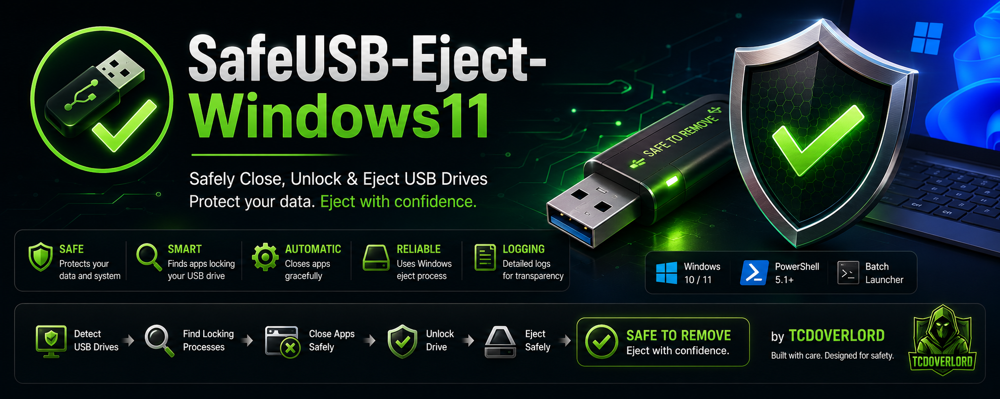
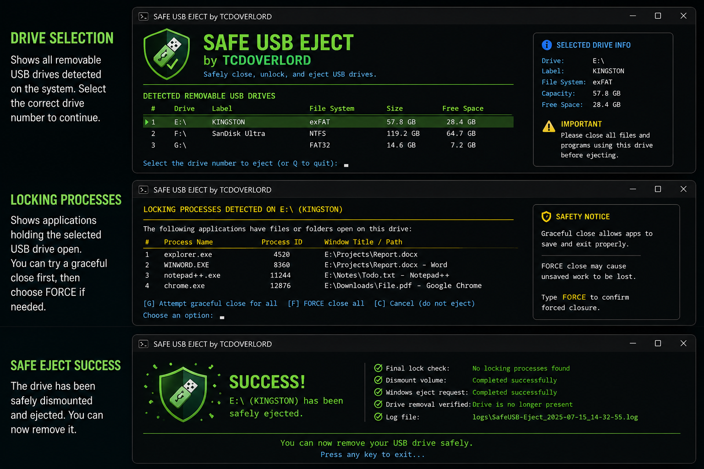
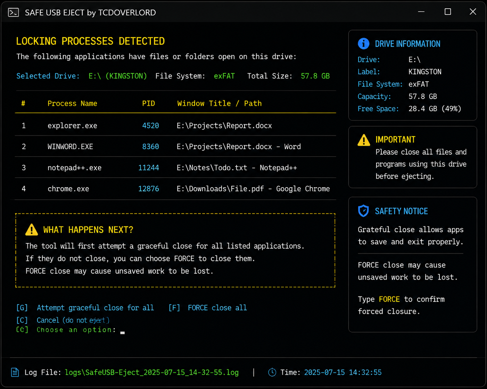
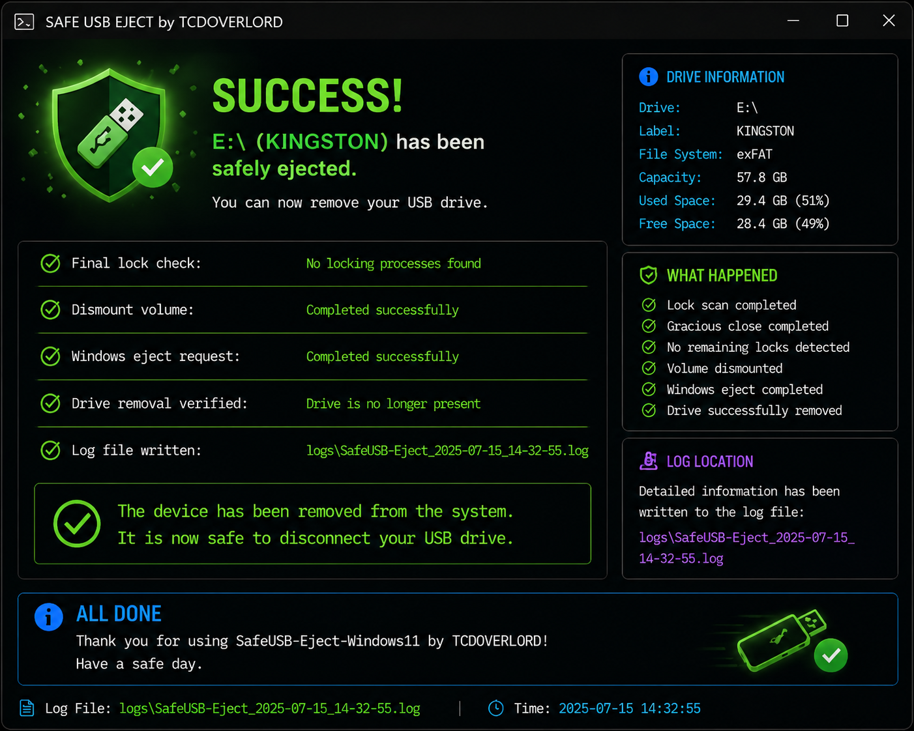
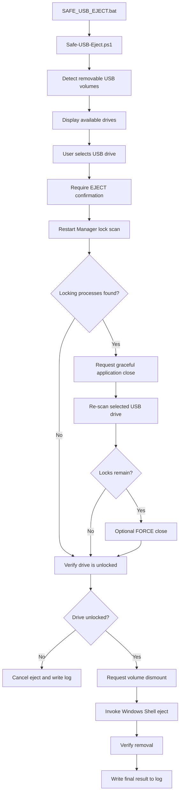
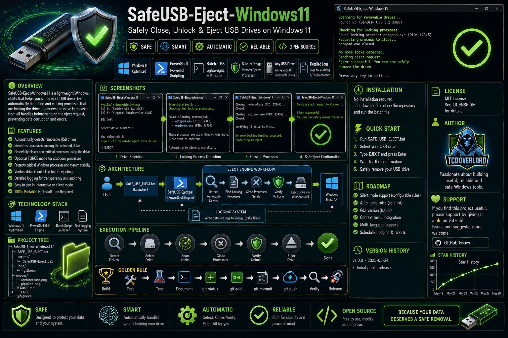

# 💾 SafeUSB-Eject-Windows11

> A safety-first Windows utility that detects applications holding a removable USB drive open, closes them carefully, verifies the drive is unlocked, and asks Windows to eject it safely.



## Technology Cards


## Overview

Windows sometimes reports that a USB device is still in use even when every visible window appears closed.

SafeUSB-Eject-Windows11 uses the Windows Restart Manager API to identify processes holding files or folders open on the selected USB drive. It first requests a graceful application close, scans the drive again, and only offers force-close when locks remain.

Before requesting removal, the utility verifies that the drive is no longer locked, requests a volume dismount, invokes the normal Windows eject action, and records the result in a dated log file.

## Features

- Automatically detects removable USB drives.
- Displays the drive letter, label, file system, size, and free space.
- Identifies locking processes through Windows Restart Manager.
- Requests graceful application closure before offering force-close.
- Refuses to force-stop protected or critical Windows processes.
- Re-scans the selected USB drive before attempting removal.
- Requests a safe volume dismount.
- Uses the standard Windows Shell eject action.
- Writes dated activity logs to the `logs/` folder.
- Requires the user to type `EJECT` before continuing.
- Requires the user to type `FORCE` before force-closing an application.
- Stops the eject process when active locks remain.

## Screenshots






## Architecture




## Execution Pipeline

```text
Launch SAFE_USB_EJECT.bat
            ↓
Start PowerShell safety engine
            ↓
Detect removable USB drives
            ↓
Display drive information
            ↓
Select the USB drive
            ↓
Type EJECT to confirm
            ↓
Scan for locking processes
            ↓
Request graceful application close
            ↓
Re-scan for remaining locks
            ↓
Optional FORCE close
            ↓
Perform final lock verification
            ↓
Request volume dismount
            ↓
Invoke Windows eject action
            ↓
Verify removal
            ↓
Write result to dated log
```

## Project Tree

```text
SafeUSB-Eject-Windows11/
├── .gitignore
├── LICENSE
├── README.md
├── SAFE_USB_EJECT.bat
│
├── docs/
│   └── SAFETY.md
│
├── images/
│   ├── SafeUSB_Eject_for_Windows_11_hero.png
│   ├── drive-selection.png
│   ├── locking-processes.png
│   └── safe-eject-success.png
│
├── logs/
│
└── scripts/
    └── Safe-USB-Eject.ps1
```

> The screenshot files are optional and may not exist until screenshots are added.

## Installation

### Download the repository

Download the latest repository ZIP from GitHub and extract it to a permanent folder.

Keep the included folder structure unchanged.

### Clone with Git

```powershell
git clone https://github.com/tcdoverlord/SafeUSB-Eject-Windows11.git
cd SafeUSB-Eject-Windows11
```

### Run the utility

Double-click:

```text
SAFE_USB_EJECT.bat
```

Administrative rights are not normally required. However, some application closures or volume dismount operations may require an elevated Windows session.

## Quick Start

1. Connect the removable USB drive.
2. Close any documents you know are open from the USB drive.
3. Double-click `SAFE_USB_EJECT.bat`.
4. Select the correct USB drive number.
5. Type `EJECT` when prompted.
6. Review any locking applications that are detected.
7. Allow the utility to request a graceful close.
8. Type `FORCE` only when you accept the risk of losing unsaved work.
9. Wait for Windows to confirm removal or for the drive to disappear from File Explorer.
10. Unplug the USB drive only after removal has been confirmed.

## Safety Warning

Force-closing an application can cause unsaved work to be lost.

The utility attempts a graceful close first and refuses to force-stop known critical Windows processes. However, users should still save their work before running the utility.

Do not unplug a USB drive while files are being copied, written, repaired, encrypted, formatted, or synchronized.

See [docs/SAFETY.md](docs/SAFETY.md) for additional safety information.

## Logs

The utility writes dated log files to:

```text
logs/
```

Logs may include:

- Selected drive information
- Detected locking processes
- Graceful-close requests
- Force-close requests
- Lock verification results
- Dismount attempts
- Eject results
- Errors and cancellation messages

Do not post logs publicly without reviewing them for private filenames or folder paths.

## Roadmap

- [ ] Add an optional graphical interface.
- [ ] Add a Windows system tray launcher.
- [ ] Display USB device model and serial information.
- [ ] Add a configurable protected-process list.
- [ ] Add optional Sysinternals Handle integration.
- [ ] Add improved USB device removal verification.
- [ ] Add digitally signed PowerShell releases.
- [ ] Create a packaged Windows executable.
- [ ] Publish automated GitHub releases.

## Version History

### v1.0.0

- Initial safety-first release.
- Added automatic removable-drive detection.
- Added USB drive selection and confirmation.
- Added Windows Restart Manager lock detection.
- Added graceful process-close requests.
- Added optional forced process closure.
- Added protected-process safety checks.
- Added final lock verification.
- Added volume dismount and Windows eject requests.
- Added dated activity logging.

## License
## License

This project is licensed under the **TCDOVERLORD Personal Learning License (TPLL) v1.0**.

This software is provided for:

* 📚 Personal learning
* 🎓 Educational use
* 🧪 Research and experimentation
* 💻 Non-commercial projects

Commercial use, redistribution, business integration, resale, or inclusion in commercial products is **not permitted** without prior written permission from the copyright owner.

If you are interested in licensing this software for commercial use, please contact **TCDOVERLORD** before using it in a business, product, or service.

See the [LICENSE](LICENSE) file for the complete license terms.

---

## Author

**TCDOVERLORD**

GitHub: https://github.com/tcdoverlord

Building practical Windows utilities, automation tools, diagnostic scripts, and open-source learning projects.

## Support

Open a GitHub issue when reporting a problem.

Include:

- Your Windows version
- The USB drive letter
- The USB file system
- The displayed locking process
- What happened after typing `EJECT`
- Whether `FORCE` was used
- Relevant entries from the matching file in `logs/`

Before sharing a log, remove any private filenames, usernames, or folder paths.

## ⭐ Star History

[](https://www.star-history.com/?repos=tcdoverlord%2FSafeUSB-Eject-Windows11&type=date&legend=top-left)

## Golden Rule

```text
Build
 ↓
Test
 ↓
Document
 ↓
git status
 ↓
git add .
 ↓
git status
 ↓
git commit
 ↓
git push
 ↓
Verify
 ↓
Release
```

---

If SafeUSB-Eject-Windows11 helped you safely remove a stubborn USB drive, consider giving the repository a ⭐.
